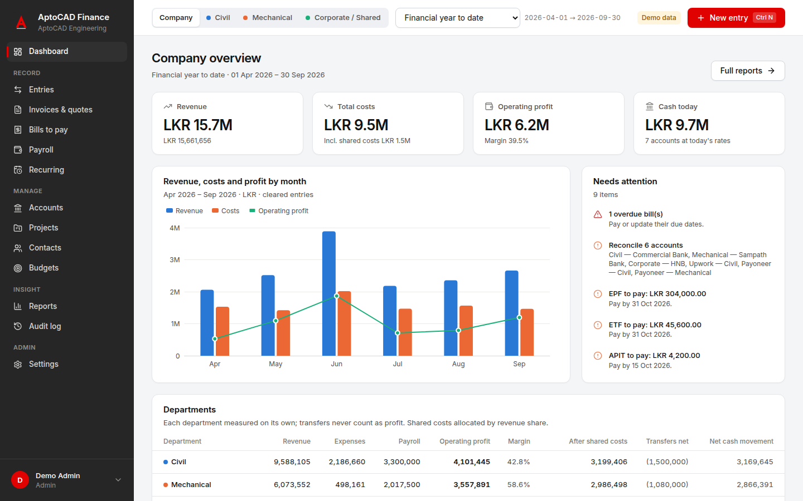
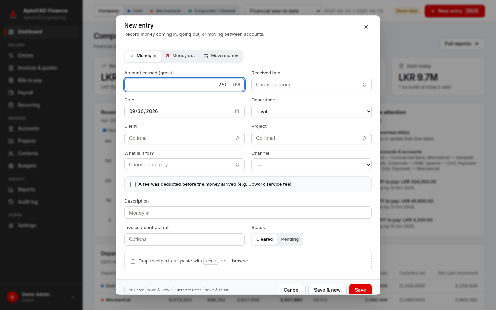
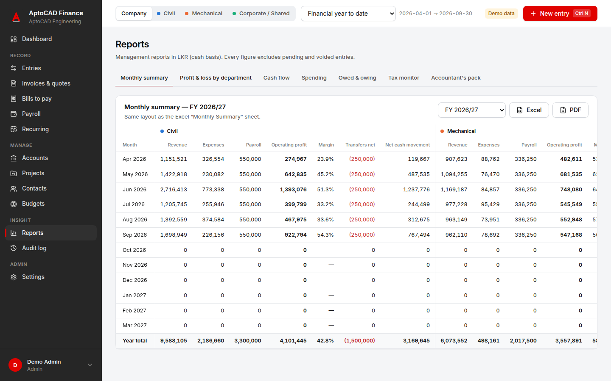
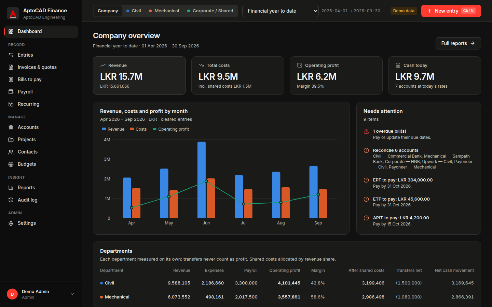

# AptoCAD Finance

A Windows desktop app for **AptoCAD Engineering's income, expenses, payroll and project profitability**.
It replaces the *AptoCAD Department Finance Tracker* Excel workbook. It is fast to fill in and clear to read,
and it enforces the company's finance rules automatically. Both directors work from their own PCs on
one shared, secure set of books.

## What it does

- **Civil and Mechanical as separate profit centres**, plus Corporate / Shared costs, with an optional
  "fully loaded" view after shared costs are allocated.
- **Quick entry (Ctrl+N):** Money in, Money out (with splits) and Move money. Smart defaults, remembered
  contacts, auto-categorisation rules, and receipts added by drag-and-drop or paste.
- **Multi-currency done properly.** Reporting is in LKR, and USD/CAD/GBP/EUR amounts keep their own values.
  The daily CBSL rate is suggested. Upwork fees are split from the gross amount. Payoneer → bank withdrawals
  book the realised exchange gain or loss. Balances show in each account's own currency.
- **Transfers never distort profit.** Department transfers change each department's cash, not its profit.
- **Sri Lankan payroll:** EPF 8% + 12%, ETF 3% and APIT, with payslip PDFs and statutory liabilities
  tracked until they are paid.
- **Projects:** contribution = revenue − direct costs − allocated payroll, with contract progress.
- **Invoices and quotes** (branded PDFs, receivables ageing), **bills to pay**, **budgets vs actual**
  and **recurring items**.
- **Bank reconciliation:** import a CSV statement from any bank, Payoneer or Upwork, match lines
  automatically, and finish only when the balances agree.
- **Reports:** a monthly summary in the Excel layout, P&L by department, cash flow, spending, ageing, a tax
  monitor (income tax, SSCL, VAT thresholds), and a one-click **accountant's pack**.
- **Control:** roles per department enforced by the database, void-with-reason instead of delete, a full
  audit log, month lock, and live updates between PCs.
- **Import the existing Excel tracker**, with a row-by-row preview. Re-running the import never duplicates rows.
- Light and dark themes, keyboard shortcuts, and a demo mode with six months of sample data.

| Quick add | Reports | Dark theme |
|---|---|---|
|  |  |  |

## Get started

- **Use it:** follow [docs/SETUP.md](docs/SETUP.md). It covers creating the Supabase database, installing
  the app, adding users and importing the workbook.
- **Try it:** install the app (or run `npm install && npm run dev`) and click **Try the demo**.

## Documentation

| Document | For |
|---|---|
| [Setup](docs/SETUP.md) | Admin: database, installation, users, updates |
| [User guide](docs/USER_GUIDE.md) | Everyday use and the month-end checklist |
| [Accounting policies](docs/ACCOUNTING.md) | Directors and accountant: exactly what each screen records |
| [Development](docs/DEVELOPMENT.md) | Developers: architecture, tests, releases |
| [Workbook review](docs/01-workbook-review.md) · [Research](docs/02-market-research.md) · [Roadmap](docs/03-roadmap.md) | Background and planning |

## Technology

Tauri 2 (Windows installer of about 10 MB), React + TypeScript, Supabase (Postgres with row-level security,
Auth, Storage and Realtime), ECharts, ExcelJS and react-pdf.

Tests:
- 50+ unit tests covering money maths, posting rules, payroll and reports
- database tests of security and posting on Postgres 16
- Playwright end-to-end tests
- a Windows build in CI
