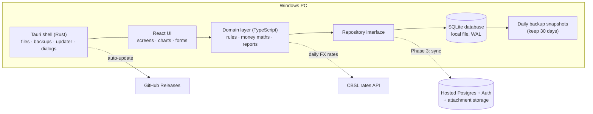
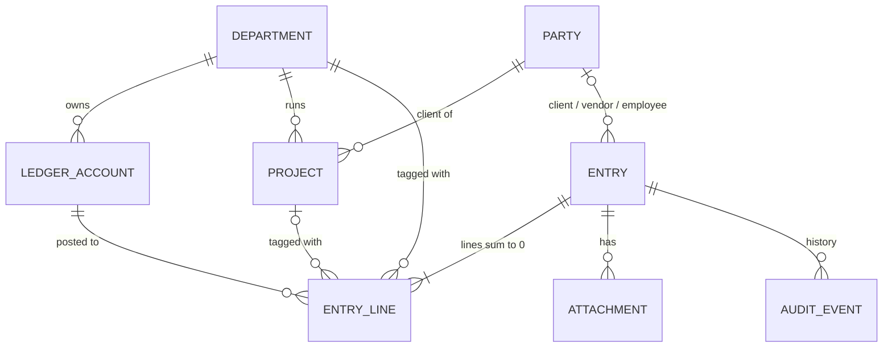
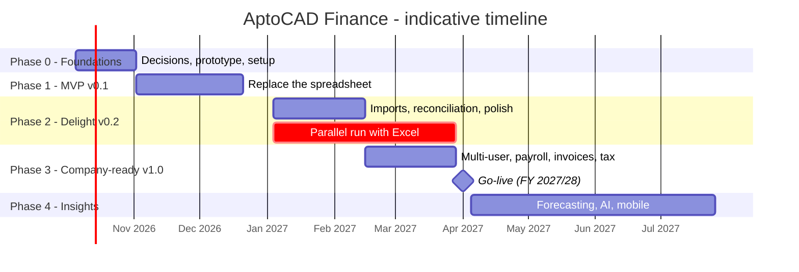

# 3. Product roadmap: AptoCAD Finance (working title)

A **Windows desktop app** that replaces the *AptoCAD Department Finance Tracker* workbook. It's quick to fill
in, clear to read, and it enforces the company's finance rules automatically.

> Inputs: [Workbook review](01-workbook-review.md) · [Market & technology research](02-market-research.md)

---

## 3.1 Vision and success measures

**Vision:** *"Know where every rupee came from and went to, per department and per project, in under a minute a day."*

| Goal | Measure | Target |
|---|---|---|
| Easy to record | Median time to add an expense | **≤ 15 seconds** |
| Easy to close the month | Time to reconcile all accounts for a month | **≤ 1 hour** |
| Trustworthy numbers | App vs. Excel totals during the parallel run | **100% match** (±LKR 1 rounding) |
| Attractive, low effort | System Usability Scale (SUS) score from both directors | **≥ 80** |
| Adoption | Excel still needed after go-live | **None** |

---

## 3.2 Users and permissions

| Role | Who | Can do |
|---|---|---|
| **Owner / Admin** | Company admin | Everything, including settings, users, month lock and backups |
| **Department Director** | Civil Director, Mechanical Director | Full edit rights in their own department. Read-only company view. |
| **Bookkeeper** (optional) | Office staff | Add and edit entries in both departments. No settings. |
| **Accountant** (optional) | External accountant | Read-only, plus exports |

*Phase 1 is single-user on one PC. Roles and multi-PC use arrive in Phase 3 (see section 3.13, decision 1).*

---

## 3.3 Product principles: what "easy and attractive" means

| Principle | In practice |
|---|---|
| **Fast capture** | **Ctrl+N** opens Quick Add from anywhere. Today's date, the last account and LKR are filled in. Picking a vendor fills its usual category. **Save & new** (Ctrl+Enter). Paste or drag a receipt straight in. |
| **Plain language** | Menus say *Money in · Money out · Platform payout · Move money · Pay staff*. No debits or credits on screen. |
| **Rules built in** | The START HERE rules are enforced: transfers never hit profit, payroll can't be entered as an expense, FX is required for foreign currency, and Void replaces Delete. |
| **Every number is clickable** | Click any KPI, chart bar or total to see the entries behind it. Nothing is a black box. |
| **Beautiful by default** | Fluent-inspired layout, the AptoCAD red `#EA0200` accent on charcoal `#262626`, light and dark themes, smooth charts, and consistent colours: green = in, red = out, grey = move, amber = needs attention. |
| **Gentle nudges** | A "Needs attention" panel lists missing receipts, unreconciled accounts, EPF due dates and entries missing a project. |
| **Offline and quick** | Local database, so every screen opens in under 300 ms and works without internet. |
| **Safe** | Automatic daily backups, one-click restore, and export to Excel at any time. |
| **Accessible** | Full keyboard navigation, works at 125–150% Windows scaling, high-contrast friendly. |

---

## 3.4 Feature map by release

| Area | Feature | v0.1 MVP | v0.2 | v1.0 | Later |
|---|---|:-:|:-:|:-:|:-:|
| **Capture** | Money in / Money out with department, project, client/vendor, category | ● | | | |
| | **Platform payout** (gross, fee, net in one entry, e.g. Upwork) | ● | | | |
| | **Move money** between any accounts, cross-currency, with FX gain/loss | ● | | | |
| | Department transfer (Civil ⇄ Mechanical, excluded from profit) | ● | | | |
| | Payroll, simple (gross / employer extras / net, as in Excel) | ● | | | |
| | Quick Add (Ctrl+N), duplicate entry, Save & new | ● | | | |
| | Receipt and invoice attachments (drag-drop, paste, PDF/image preview) | | ● | | |
| | Recurring entries (software subscriptions, internet, rent) | | ● | | |
| | CSV import for bank, **Payoneer** and **Upwork** statements, with duplicate detection | | ● | | |
| | Auto-categorisation rules ("vendor contains *Autodesk* → Software") | | ● | | |
| | Full payroll run: EPF 8/12%, ETF 3%, APIT, payslips, statutory liabilities | | | ● | |
| | Receipt OCR (read amount, date and vendor from a photo or PDF) | | | | ● |
| **Money** | Accounts with balances in their **own currency** plus an LKR value | ● | | | |
| | Daily **CBSL FX rate auto-fill** with manual override and offline cache | ● | | | |
| | Reconciliation screen (tick off against a statement, lock reconciled items) | | ● | | |
| | Unrealised FX revaluation of foreign-currency accounts | | | ● | |
| **Projects** | Project register, auto codes, contribution and margin | ● | | | |
| | Contract value vs. received, outstanding balance | | ● | | |
| **Reports** | Dashboard with Company / Civil / Mechanical switcher and charts | ● | | | |
| | Monthly Summary (same numbers as the Excel sheet) | ● | | | |
| | Financial year **April–March** or calendar year, plus custom ranges | ● | | | |
| | Export to Excel (formatted) | ● | | | |
| | P&L by department, cash-flow statement, spend by category, PDF reports | | ● | | |
| | Shared-cost allocation ("fully loaded" department profit) | | | ● | |
| | Budgets and targets vs. actual | | | ● | |
| | Cash-flow forecast (recurring items + open invoices) | | | | ● |
| **Sales & bills** | Quotes and invoices (USD/LKR, PDF, branded), receivables ageing | | | ● | |
| | Bills to pay with due-date reminders | | | ● | |
| **Tax** | Tax provision estimate (service-export income tax), SSCL/VAT turnover monitor, all rates configurable | | | ● | |
| **Control** | Void with reason. Every change recorded in the audit log. | ● | | | |
| | Audit history viewer, **month lock** (period close) | | | ● | |
| | Users, roles, department-level permissions | | | ● | |
| | **Multi-PC sync** (both directors on their own PCs) | | | ● | |
| | App lock (PIN / Windows Hello), encrypted database | | | ● | |
| **Platform** | Windows installer, auto-update, light/dark theme | ● | | | |
| | **Import the existing Excel workbook** | ● | | | |
| | Automatic daily backups and one-click restore | ● | | | |
| | Mobile companion for snapping receipts | | | | ● |
| | AI assistant ("What did Civil spend on software this FY?"), anomaly alerts | | | | ● |
| | Double-entry journal export for the accountant | | | | ● |

---

## 3.5 Recommended technology stack

| Layer | Choice | Why |
|---|---|---|
| Desktop shell | **Tauri 2** (Rust) | Installer around 3–10 MB. Uses WebView2, which is already on Windows 10/11. Low memory use. Built-in updater, file dialogs and single-instance support. |
| UI | **React + TypeScript + Vite** | The largest ecosystem for polished UIs, and the stack AI coding assistants handle best. |
| Styling & components | **Tailwind CSS + shadcn/ui** (Radix) + Lucide icons | A modern, accessible look out of the box. Easy to theme with AptoCAD colours and dark mode. |
| Tables | **TanStack Table + TanStack Virtual** | Fast, sortable, filterable registers with thousands of rows. |
| Charts | **Apache ECharts** | Attractive, interactive charts, with click-through for drill-down. |
| Forms & validation | **React Hook Form + Zod** | One schema validates forms, imports and the database layer. |
| Database | **SQLite** (WAL mode) via `tauri-plugin-sql`, with **Drizzle ORM** migrations | A single local file, fast, reliable and easy to back up. |
| Money maths | Integer **minor units** (cents) + **decimal.js** for FX | No floating-point rounding errors. |
| Excel | **ExcelJS** | Import the existing workbook. Export formatted reports. |
| PDF | **@react-pdf/renderer** | Monthly reports, statements and (later) invoices. |
| FX rates | Frankfurter API with the CBSL provider, cached locally | Free, daily CBSL rates, and still works offline. |
| Testing | **Vitest** (domain & money maths) + **Playwright** (UI flows) | Golden tests prove the numbers match Excel. |
| Build & release | **GitHub Actions** (Windows runner) + `tauri-action` → NSIS installer; updates from GitHub Releases; code-signed | Push a tag and get a signed installer with auto-update. |
| Sync (Phase 3) | **Hosted Postgres + Auth + file storage** (e.g. Supabase), or a small LAN server | Shared data for multiple PCs with per-department security. The final choice is made in Phase 3. |

**Why not the alternatives?** Electron works, but its installer is 80–250 MB. WPF is mature but
dated. **.NET 10 + WinUI 3** is the best choice if the developer strongly prefers C# and a 100% native
Windows 11 look. In that case, swap the UI and data layers (e.g. WinUI 3 + CommunityToolkit.Mvvm + EF Core + LiveCharts2 + Velopack)
and keep every phase below unchanged.

**Key design rule:** the domain layer (rules, money maths, reports) is plain TypeScript behind a
*repository interface*. The UI never talks to SQL directly. That lets Phase 3 swap local-only storage
for sync without rewriting screens.

---

## 3.6 Architecture



---

## 3.7 Data model

Every business event is one **entry**, made of **lines that balance to zero** in LKR. This is
double-entry under the hood, and the user never sees it. Transfers, platform fees, FX conversions and
payroll liabilities are then easy to record, and **account balances can't drift**. That's the root
cause of issues H1–H4 in the workbook.



| Table | Holds | Key fields |
|---|---|---|
| `settings` | Company profile and preferences | base currency `LKR`, FY start month `4` (April), tax settings |
| `departments` | Civil, Mechanical, Corporate / Shared | `is_operating`, director |
| `ledger_accounts` | **Money accounts** (bank, Payoneer, Upwork, cash, card), **categories** (income/expense), **liabilities** (EPF/ETF/APIT payable), **equity** (opening balances) | `type`, `currency`, `department_id`, `is_direct_project_cost`, `archived` |
| `parties` | Clients, vendors, employees | `kind`, `country`, default category |
| `projects` | Project register | auto `code` (e.g. `CIV-P-0012`), department, client, contract currency/value, status, dates |
| `entries` | One business event | auto `number` (e.g. `INC-2026-0001`), `kind`, `date`, `status` (pending / cleared / void), reference, description, created by/at |
| `entry_lines` | Balanced lines | account, department, project, `currency`, `amount_minor`, `fx_rate`, `amount_lkr_minor` |
| `attachments` | Receipts and invoices | file name, SHA-256 hash, stored path |
| `fx_rates` | Daily rate cache | date, currency, rate to LKR, source |
| `recurring_templates`, `rules`, `budgets`, `period_locks`, `users`, `audit_events` | Later features | – |

**Worked example: an Upwork payout, then a conversion to LKR (Civil, project CIV-P-0012)**

| Entry | Line | Account | Currency amount | LKR (example rates) |
|---|---|---|---:|---:|
| Platform payout | Money received | Upwork (USD) | +900.00 USD | +270,000 |
| | Platform fee (10%) | Expense: Upwork / Platform Fees | +100.00 USD | +30,000 |
| | Revenue | Income: Civil / Structural Engineering | −1,000.00 USD | −300,000 |
| Move money | Sent | Upwork (USD) | −900.00 USD | −270,000 |
| | Received | Civil Bank (LKR) | +267,300.00 LKR | +267,300 |
| | FX / transfer cost (auto) | Expense: Bank / FX / Transfer Fees | | +2,700 |

*Signs are internal (+ = debit, − = credit). Each entry's LKR column sums to zero.* The user fills in
**one form per event**. The app generates the lines.

---

## 3.8 Key screens (wireframes)

**Home dashboard**

```
+----------------------------------------------------------------------------------+
| AptoCAD Finance     [ Company | Civil | Mechanical ]    FY 2026/27 v    [+ New]  |
+--------------+-------------------------------------------------------------------+
| Home         |  Revenue YTD      Costs YTD       Operating profit   Cash today   |
| Money in     |  LKR 12.4M +8%    LKR 7.9M +3%    LKR 4.5M  36%      LKR 6.1M     |
| Money out    | +-------------------------------+  +---------------------------+  |
| Move money   | | Revenue vs cost by month      |  | Cash by account           |  |
| Payroll      | | (bars) + profit (line)        |  | Civil Bank    LKR 2.3M    |  |
| Projects     | |                               |  | Payoneer      USD 3,120   |  |
| Accounts     | +-------------------------------+  +---------------------------+  |
| Reports      | +---------------------+  +--------------------------------------+ |
| Settings     | | Where money went    |  | Projects: best margin / at risk      | |
|              | | (donut by category) |  | CIV-P-0012 Permit set  1.2M  42%     | |
|              | +---------------------+  +--------------------------------------+ |
|              |  ! Needs attention: 3 expenses without receipt - Payoneer not     |
|              |    reconciled for 32 days - EPF for September due in 5 days       |
+--------------+-------------------------------------------------------------------+
```

**Quick Add (Ctrl+N)**

```
+-- New entry ---------------------------------------------------------+
| [Money in] [Money out] [Platform payout] [Move money] [Pay staff]    |
|                                                                      |
| Amount      [   1,250.00 ] [USD v]   Rate [300.00] CBSL today        |
|             = LKR 375,000.00                                         |
| Date        [2026-10-02]          Account   [Payoneer USD v]         |
| Department  [Civil v]             Project   [CIV-P-0012 v]           |
| Client      [Acme Builders v]     Category  [Permit drawings v]      |
| Note        [Structural calcs - phase 2                    ]         |
| Receipt     [ Drop a file here or press Ctrl+V ]                     |
|                                                                      |
|                         [Save & new  Ctrl+Enter]   [Save]            |
+----------------------------------------------------------------------+
```

Other screens: registers (filterable tables with totals and CSV/Excel export), Accounts (balance cards
plus reconcile), Projects (cards with margin gauges), Reports (P&L by department, monthly summary, cash
flow), Settings (departments, accounts, categories, tax rates, backups).

---

## 3.9 Delivery plan

Indicative timeline for **one developer working roughly full-time with AI coding assistance**. Double the
durations for part-time work. The plan aims to **go live on 1 April 2027**, the start of the Sri Lankan
year of assessment 2027/28, after a parallel run with Excel from January to March 2027.



### Phase 0: Foundations (Oct 2026, ~4 weeks)

- Settle the open decisions (section 3.13) and agree the chart of accounts and category list with the accountant.
- **Clickable prototype** (HTML) of Dashboard, Quick Add and the Money in register, reviewed by both directors.
- Set up the repo: Tauri 2 + React + TS, lint/format, Vitest, GitHub Actions building a Windows installer.
- Data model v1 and migrations. Collect sanitised sample data (3 months of bank, Payoneer and Upwork exports).
- Brand kit: logo, colours, typography, icon set.

**Exit criteria:** the prototype is approved, the CI build produces an installer, and the data model is signed off.

### Phase 1: MVP "Replace the spreadsheet" → v0.1 (Nov–Dec 2026, ~7 weeks)

- Settings: departments, money accounts (with currency), categories (with the *direct project cost* flag), clients and vendors.
- Capture: Money in, Money out, **Platform payout**, **Move money** (cross-currency), Department transfer, simple Payroll, Void with reason.
- Quick Add, Save & new, smart defaults, CBSL FX auto-fill.
- Projects with auto codes and live profitability.
- Dashboard with charts, Monthly Summary, department switcher, FY/calendar/custom periods, drill-down.
- **Import the Excel workbook** (all registers) and export to Excel.
- Automatic daily backups and restore. Audit events recorded in the background.
- Signed installer and auto-update.

**Exit criteria:** a full month of real data is entered in under 1 hour, and Monthly Summary figures **equal the
Excel workbook** for the same data (automated golden test). Install, update, backup and restore are tested on a clean Windows 10 and Windows 11 PC.

### Phase 2: "Make it delightful" → v0.2 (Jan–mid-Feb 2027, ~6 weeks)

- Receipt attachments (drag-drop, paste, preview) and a "missing receipt" nudge.
- CSV import for bank, Payoneer and Upwork statements, with duplicate detection and matching.
- **Reconciliation** screen. Auto-categorisation rules. Recurring entries.
- Reports: P&L by department, cash flow, spend by category, project contract vs. received. PDF export.
- UI polish: dark mode, empty states, onboarding tour, keyboard shortcuts cheat-sheet, performance pass.
- **Parallel run starts**: January 2027 is entered in both Excel and the app.

**Exit criteria:** a month is imported and reconciled in under 30 minutes, the median expense entry takes 15 seconds or less, and no entry is missing FX.

### Phase 3: "Run the company on it" → v1.0 (mid-Feb–Mar 2027, ~6 weeks)

- **Multi-PC sync**, users and roles (department directors, bookkeeper, read-only accountant), app lock.
- **Full payroll run**: EPF/ETF/APIT, payslip PDF, statutory liabilities and payment reminders.
- Quotes and invoices (USD/LKR, branded PDF), receivables ageing. Bills to pay with reminders.
- Budgets vs. actual. Shared-cost allocation view. Unrealised FX revaluation.
- Tax: service-export income tax provision and SSCL/VAT turnover monitor, all configurable.
- Month lock (period close), audit history viewer, year-end export pack for the accountant.

**Exit criteria:** both directors work from their own PCs, the parallel run (Jan–Mar) matches Excel, the
accountant accepts the export pack, and the SUS score is 80 or higher. **Go live on 1 April 2027 and retire the workbook.**

### Phase 4: Insights and reach (Apr 2027 onwards)

Cash-flow forecast · receipt OCR · AI assistant for plain-English questions and anomaly alerts · mobile
receipt companion · double-entry journal export · extra departments and currencies as the company grows.
Prioritised from real usage feedback.

---

## 3.10 Migration from Excel

1. **Import:** a wizard maps each sheet (Accounts, Projects, Income, Expenses, Payroll, Transfers) to app records, fills missing FX rates, and flags rows that break the rules. For example, rows that need a *Move money* entry instead of a department transfer.
2. **Opening balances:** enter each account's balance **in its own currency** as at the cut-over date.
3. **Parallel run (Jan–Mar 2027):** record in both. A **comparison report** checks the app against every `Monthly Summary` cell.
4. **Cut-over (1 Apr 2027):** archive the workbook as read-only and use the app from then on.

---

## 3.11 Quality, security and operations

- **Correctness:** all money is stored as integers. FX is applied once, at posting time, and the LKR value is stored. Automated tests cover every rule in the workbook review (section 1.2). Golden tests compare results with the Excel formulas.
- **Data safety:** SQLite WAL mode, automatic daily snapshots (kept for 30 days) to a folder you choose, such as OneDrive. The live database file is **not** kept in a sync folder. Restore is tested each release.
- **Security:** Phase 1 relies on the Windows account and BitLocker. Phase 3 adds an app PIN or Windows Hello, an encrypted database, role-based permissions and an audit log.
- **Privacy:** data stays on the PC (and later the company's own cloud project). No analytics without opt-in.
- **Releases:** semantic versions, changelog, signed installer (Azure Trusted Signing or an OV certificate, so Windows SmartScreen doesn't warn), and staged auto-update.
- **Support:** in-app "Send diagnostics" (logs only, never financial data) and a short user guide.

---

## 3.12 Risks and mitigations

| Risk | Impact | Mitigation |
|---|---|---|
| Scope grows into a full accounting system | Delays | Stay focused on management reporting. The accountant keeps statutory books from our exports. |
| Multi-PC sync is complex | Phase 3 slips | Design for sync from day 1 (UUIDs, audit log, repository interface). Use a managed backend rather than building one. Decide early (section 3.13, decision 1). |
| Tax rules change | Wrong provisions | Every rate and threshold is a setting. Accountant reviews before go-live and at each budget. |
| Data loss | Severe | Automatic backups, tested restore, Excel export at any time. |
| People keep using Excel | Low adoption | Faster than Excel, imports existing data, parallel run proves the numbers match. |
| FX API unavailable | Blocked entry | Offline cache, manual rate entry, a second provider as fallback. |
| Unsigned installer warnings | Distrust | Code-sign from v0.1. |
| Single developer | Knowledge risk | Mainstream stack, tests, docs in this repo. |

---

## 3.13 Decisions needed from you

1. **How many people and PCs will enter data from day one?** If both directors need it immediately, sync moves from Phase 3 into Phase 1 (about +3 weeks).
2. **Cash basis only, or invoices and receivables too?** The plan assumes cash basis for v0.1 and invoices in v1.0.
3. **Default reporting year:** April–March (recommended) or January–December?
4. **Upwork:** record gross plus fee (recommended, so fees are visible) or net only?
5. **Shared costs:** allocate to departments for a "fully loaded" view? If so, by revenue share, headcount or a fixed %?
6. **Developer:** in-house with AI assistance or a contractor? TypeScript (recommended) or C#?
7. **Budget:** code-signing certificate (yearly) and, from Phase 3, a hosted database (monthly).
8. **Name and branding:** "AptoCAD Finance" or something else?

---

## 3.14 Next steps (first two weeks)

1. Answer the decisions in section 3.13.
2. Export 3 months of bank, Payoneer and Upwork statements (sanitised) as test data.
3. Build the clickable **HTML prototype** of Dashboard + Quick Add and review it together.
4. Scaffold the Tauri 2 + React + TypeScript project with CI producing a Windows installer.
5. Implement data model v1 and the Excel workbook importer.
